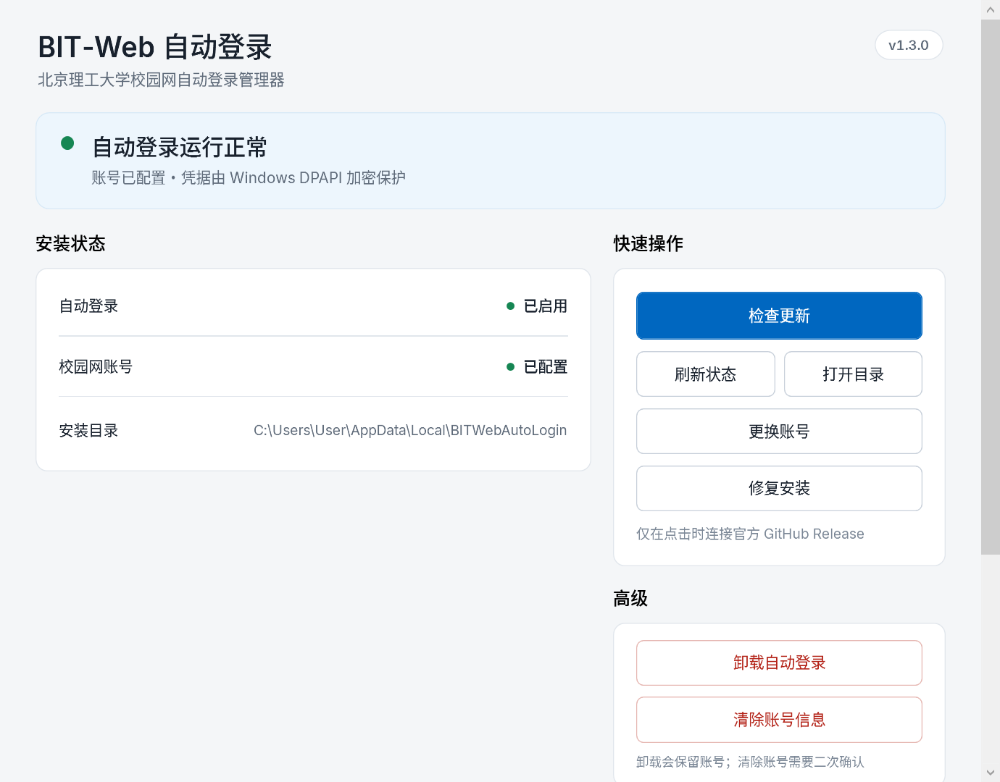

  

  
  
  

  给北理工校园网用户的 Windows 后台认证工具。
   
  电脑已经连上 <code>BIT-Web</code> 或校园网有线时，网页认证失效后自动恢复公网。

  <a href="#快速开始"><strong>快速开始</strong></a> ·
  <a href="#使用管理器">使用管理器</a> ·
  <a href="#安全边界">安全边界</a> ·
  <a href="#常见问题">常见问题</a>

> **适用范围：** 本项目只面向北京理工大学校园网环境。它负责恢复校园网网页认证，不负责连接 Wi-Fi，也不会创建、切换或修改网卡。

## BIT-Web 是什么

BIT-Web Auto Login 是一个面向北京理工大学校园网的小型 Windows 工具。它在 Windows 用户登录后静默运行：公网认证失效时自动恢复登录，网络正常时不会重复提交认证。

- 支持 `BIT-Web` Wi-Fi 和校园网有线接入；
- 校园网密码由 Windows DPAPI 加密后保存在本机；
- Native Manager 集中提供状态、安装、修复、换号、更新和卸载入口；
- Manager 按需打开，关闭即退出，不驻留托盘、不随 Windows 启动。

## 快速开始

### 系统要求

- Windows 10 或 Windows 11（x64）。
- Windows PowerShell 5.1。
- Windows 已经保存并能够连接 <code>BIT-Web</code>，或已经接入北理工校园网有线网络。
- 当前用户可以使用 Windows 任务计划程序。

### 1. 下载 Release

从[官方 GitHub Releases](https://github.com/Oblivionis-ling/bit-web-auto-login/releases)下载 `BITWebAutoLogin-v1.3.0-win-x64.zip`，然后完整解压。正式包已包含 Native Manager、Updater 和 .NET 8 Windows Desktop Runtime，不要求安装 Git 或 .NET。

### 2. 安装并打开管理器

双击 `Install.cmd`。安装完成后，从 Windows 开始菜单打开 **BIT-Web 自动登录管理器**；快捷方式会直接启动 `BITWebManager.exe`。

首次安装会弹出 Windows 凭据输入框。输入校园网账号和密码后，凭据使用当前 Windows 用户的 DPAPI 安全保存；密码不会出现在命令行或 Manager 日志中。

> Windows Defender SmartScreen 可能对尚未建立信誉的未签名版本显示提示。请只从本仓库的 Releases 下载，并在继续前核对文件名与 Release 页面提供的 SHA-256。

## 使用管理器

打开 Manager 后，顶部状态会直接说明自动登录是否正常、校园网账号是否已配置；右上角显示当前 BIT-Web 版本。已安装时主操作是 **检查更新**，未安装时主操作是 **安装自动登录**。

- **检查更新**：仅在点击时连接官方 GitHub Release；不会后台定时检查。
- **更换账号**：继续使用 Windows 安全凭据窗口，不读取或显示已保存密码。
- **修复安装**：重新部署当前版本，不清除现有凭据。
- **卸载自动登录**：停止并移除自动登录任务，保留 Manager、设置、日志和账号。
- **清除账号信息**：经过两次确认后停用任务并删除当前用户的 DPAPI 凭据。

### 安全更新

Manager 固定访问 `Oblivionis-ling/bit-web-auto-login` 的最新稳定 Release。更新包在部署前会校验来源、重定向、SHA-256、ZIP 路径、必要文件、版本和 PowerShell 语法，再由独立 Updater 完成替换、健康检查及必要回滚。既有 `credential.xml` 不会进入更新包，也不会被更新流程覆盖。

## 更新、换号与卸载

普通维护都可以从 Manager 完成。仅在 Manager 无法启动时，再使用下面的脚本入口。

<strong>需要维护命令时再展开</strong>

~~~powershell
# 更换校园网账号或密码
powershell.exe -NoProfile -ExecutionPolicy Bypass -File .\Install.ps1 -RefreshCredential

# 卸载后台任务
powershell.exe -NoProfile -ExecutionPolicy Bypass -File .\Uninstall.ps1
~~~

## 安全边界

- 用户名在凭据文件中可见；密码由 Windows DPAPI 保护，只能由创建它的 Windows 用户在同一台电脑上解密。
- 程序不会创建、切换、启用、禁用或修改网络连接。
- 默认认证入口使用 HTTP，这是北理工校园网服务端的既有条件；脚本无法替服务端增加 HTTPS。
- 在线更新只在点击 **检查更新** 后访问固定的 GitHub HTTPS API；不会上传账号、密码、日志或设置。
- 校园网有线默认识别 <code>10.*</code> 地址。若电脑可能接入其他同地址段网络，建议只使用 <code>Wifi</code> 模式。

## 常见问题

### 为什么 Windows 会显示 SmartScreen？

当前 v1.3 构建尚未使用 Authenticode 代码签名，新发布的 EXE 可能暂时没有 SmartScreen 信誉。这不代表 Windows 已判断程序恶意。请只从官方 Release 下载、核对 SHA-256，不要从网盘或第三方镜像获取安装包。

### Manager 关闭后自动登录还会运行吗？

会。Manager 只负责按需管理，关闭即退出；自动登录由独立的当前用户计划任务运行。

### 卸载自动登录会删除账号吗？

不会。卸载只停止并移除自动登录任务，Manager、设置、日志和 DPAPI 凭据都会保留。清除账号信息是单独且需要二次确认的操作。

### 更新或修复需要重新输入账号吗？

正常情况下不需要。安装器和 Updater 会保留现有 `credential.xml`，升级测试会通过文件 SHA-256 确认凭据未被改写。

### 更新下载出现连接重置或超时怎么办？

请切换网络或代理节点后重新点击 **检查更新**。如果失败发生在正式部署前，当前安装不会被修改；重新下载后仍会执行完整的来源、SHA-256 和包结构校验。

## 技术与项目结构

<strong>展开仓库结构</strong>

~~~text
.
├── Install.cmd                      # 可双击的一键安装入口
├── manager/                         # C# / WPF Native Manager 与 Updater 源码
├── build/Build-Release.ps1          # 一条命令生成 ZIP、SHA-256 与 manifest
├── Open-GUI.* / Manage.ps1          # 源码仓库中的 legacy fallback
├── BITWebAutoLogin.Management.psm1  # GUI 管理操作层
├── Install.ps1                      # 当前用户安装与升级
├── Uninstall.ps1                    # 停止并移除任务
├── AutoLogin.ps1                    # 监控循环与状态日志
├── RunHidden.vbs                    # 计划任务的无窗口启动器
├── BITWebAutoLogin.psm1             # 连接判断、表单与 Srun 认证实现
├── settings.json                    # 非敏感运行配置
├── scripts/
│   ├── Get-ManagerStatus.ps1        # Native Manager 状态 JSON bridge
│   ├── Invoke-ManagerAction.ps1     # Native Manager 操作 JSON bridge
│   └── Test-ManagerUpdatePackage.ps1# 更新包 PowerShell 语法检查
├── tests/
│   ├── Offline.Tests.ps1            # 完全离线的逻辑回归测试
│   └── Test-Diagnostics.ps1         # 只读运行诊断
├── docs/
│   ├── 全面测试流程-v1.1.md          # 人工验收流程
│   └── archive/
│       └── README-v1.2-before-redesign.md
└── .github/workflows/
    └── powershell-tests.yml         # Windows CI
~~~

测试与文档不会被安装器复制到正式运行目录。

## 开发与测试

当前项目保留了以下测试与验收内容：

- **PowerShell 与 C# 离线回归测试**：覆盖登录核心、状态与操作协议、Release 校验、Native Installer 迁移、凭据保持、回滚和 GUI 管理边界。
- **PowerShell 源码解析与 Windows CI**：每次推送或 Pull Request 都会检查脚本语法，并运行同一套离线测试。
- **只读运行诊断**：检查连接资格、计划任务、后台进程和日志，不修改网络设置。
- **真实环境人工验收**：覆盖断网恢复、错误网络保护、睡眠唤醒、重启和长期运行。

测试实现位于 [tests/Offline.Tests.ps1](tests/Offline.Tests.ps1)，完整人工流程见 [docs/全面测试流程-v1.1.md](docs/全面测试流程-v1.1.md)，版本变化见 [CHANGELOG.md](CHANGELOG.md)。

---

  BIT-Web Auto Login v1.3.0 · 北京理工大学校园网 · Windows 当前用户后台任务

