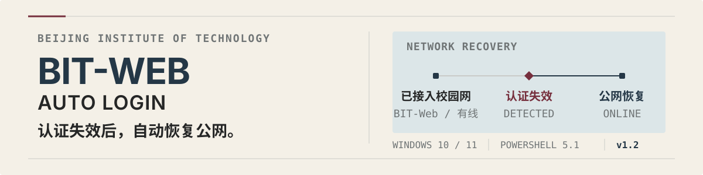

  

  
  
  

  给北理工校园网用户的 Windows 后台认证工具。
   
  电脑已经连上 <code>BIT-Web</code> 或校园网有线时，网页认证失效后自动恢复公网。

  <a href="#快速开始"><strong>快速开始</strong></a> ·
  <a href="#更新换号与卸载">维护</a> ·
  <a href="#安全边界">安全边界</a> ·
  <a href="#项目结构">项目结构</a>

> **适用范围：** 本项目只面向北京理工大学校园网环境。它负责恢复校园网网页认证，不负责连接 Wi-Fi，也不会创建、切换或修改网卡。

## 它能做什么

- 同时支持北理工 <code>BIT-Web</code> Wi-Fi 与校园网有线接入。
- Windows 用户登录后静默启动，在后台保持校园网认证。
- 公网认证失效时自动重新登录；公网正常时不会提交认证。
- 校园网密码使用 Windows DPAPI 加密后保存在本机。
- 遇到短暂断网或认证失败会自动等待并继续尝试，避免频繁重复登录。

## 快速开始

### 系统要求

- Windows 10 或 Windows 11。
- Windows PowerShell 5.1。
- Windows 已经保存并能够连接 <code>BIT-Web</code>，或已经接入北理工校园网有线网络。
- 当前用户可以使用 Windows 任务计划程序。

### 1. 获取项目

~~~powershell
git clone https://github.com/Oblivionis-ling/bit-web-auto-login.git
cd bit-web-auto-login
~~~

也可以在 GitHub 页面选择 **Code → Download ZIP**，下载并解压。

### 2. 安装

进入项目目录，双击 <code>Install.cmd</code>。

首次安装会弹出 Windows 凭据输入框。输入校园网账号和密码后，程序会在后台运行，并在以后登录 Windows 时自动启动。

## 更新、换号与卸载

- **更新版本**：下载最新代码后，再次双击 <code>Install.cmd</code>。原有加密凭据会继续保留。
- **更换账号或密码**：重新运行安装器并使用 <code>-RefreshCredential</code>。
- **卸载后台任务**：运行 <code>Uninstall.ps1</code>。脚本默认保留设置、日志和加密凭据。

<strong>需要维护命令时再展开</strong>

~~~powershell
# 更换校园网账号或密码
powershell.exe -NoProfile -ExecutionPolicy Bypass -File .\Install.ps1 -RefreshCredential

# 卸载后台任务
powershell.exe -NoProfile -ExecutionPolicy Bypass -File .\Uninstall.ps1
~~~

## 安全边界

- 用户名在凭据文件中可见；密码由 Windows DPAPI 保护，只能由创建它的 Windows 用户在同一台电脑上解密。
- 程序不会创建、切换、启用、禁用或修改网络连接。
- 默认认证入口使用 HTTP，这是北理工校园网服务端的既有条件；脚本无法替服务端增加 HTTPS。
- 校园网有线默认识别 <code>10.*</code> 地址。若电脑可能接入其他同地址段网络，建议只使用 <code>Wifi</code> 模式。

## 项目结构

<strong>展开仓库结构</strong>

~~~text
.
├── Install.cmd                      # 可双击的一键安装入口
├── Install.ps1                      # 当前用户安装与升级
├── Uninstall.ps1                    # 停止并移除任务
├── AutoLogin.ps1                    # 监控循环与状态日志
├── RunHidden.vbs                    # 计划任务的无窗口启动器
├── BITWebAutoLogin.psm1             # 连接判断、表单与 Srun 认证实现
├── settings.json                    # 非敏感运行配置
├── scripts/
│   └── Setup-Credential.ps1         # 单独创建 DPAPI 凭据
├── tests/
│   ├── Offline.Tests.ps1            # 完全离线的逻辑回归测试
│   └── Test-Diagnostics.ps1         # 只读运行诊断
├── docs/
│   ├── 全面测试流程-v1.1.md          # 人工验收流程
│   └── archive/
│       └── README-v1.2-before-redesign.md
└── .github/workflows/
    └── powershell-tests.yml         # Windows CI
~~~

测试与文档不会被安装器复制到正式运行目录。

## 开发与测试

当前项目保留了以下测试与验收内容：

- **22 项完全离线的回归测试**：覆盖登录表单解析、同源保护、Srun 编码向量、Wi-Fi 与有线连接筛选、断网决策、冷却与重试、安装预览，以及“不得修改网卡”等安全边界。
- **PowerShell 源码解析与 Windows CI**：每次推送或 Pull Request 都会检查脚本语法，并运行同一套离线测试。
- **只读运行诊断**：检查连接资格、计划任务、后台进程和日志，不修改网络设置。
- **真实环境人工验收**：覆盖断网恢复、错误网络保护、睡眠唤醒、重启和长期运行。

测试实现位于 [tests/Offline.Tests.ps1](tests/Offline.Tests.ps1)，完整人工流程见 [docs/全面测试流程-v1.1.md](docs/全面测试流程-v1.1.md)，版本变化见 [CHANGELOG.md](CHANGELOG.md)。

---

  BIT-Web Auto Login v1.2 · 北京理工大学校园网 · Windows 当前用户后台任务

