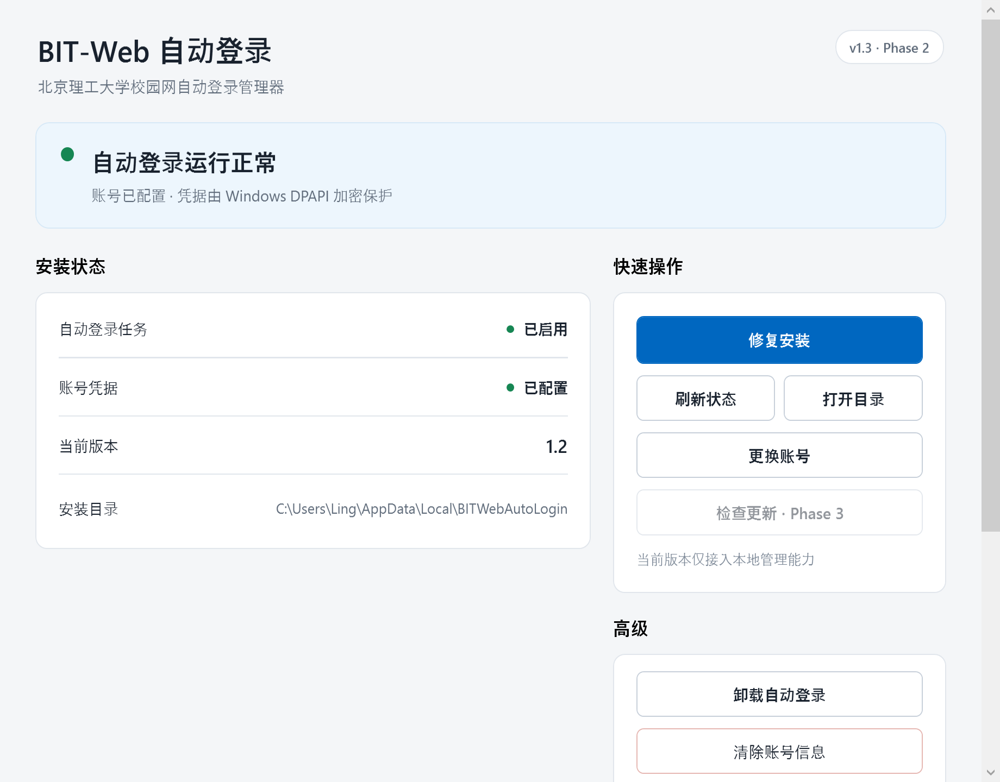

# BIT-Web Auto Login v1.3 Phase 2 Report

Phase 2 已完成，并按要求暂停等待验收。Native Manager 现已具备除 GitHub 更新外的完整本地管理入口。

## 实际 GUI 截图

当前本机真实状态，200% DPI：



当前真实读取结果：

```text
TaskState        = Ready
CredentialExists = true
InstalledVersion = 1.2
```

## 已接入功能

```text
Refresh Status      ✓
Open Directory      ✓
Refresh Credential  ✓
Install             ✓
Repair              ✓
Uninstall            ✓
Clear Credential    ✓
GitHub Update        ✗ Phase 3
```

## Action 桥接设计

新增统一入口：

```text
scripts/Invoke-ManagerAction.ps1
```

支持固定白名单：

```text
RefreshCredential
Install
Repair
Uninstall
ClearCredential
```

更新操作不在允许列表中。

返回协议：

```json
{
  "schemaVersion": 1,
  "success": true,
  "action": "repair",
  "message": "Action completed.",
  "requiresRefresh": true,
  "errorCode": null
}
```

失败时：

- stdout：结构化失败 JSON；
- stderr：技术异常；
- exit code：非零；
- C#：负责映射中文用户提示。

桥接脚本不直接实现计划任务、凭据或安装逻辑。

## PowerShell 复用关系

| GUI 操作 | 后端实现 |
|---|---|
| 更新账号 | `Install-BITWebAutoLogin -RefreshCredential` |
| 安装 | `Install-BITWebAutoLogin` |
| 修复 | `Install-BITWebAutoLogin -UpdateOnly` |
| 卸载 | `Uninstall-BITWebAutoLogin` |
| 清除账号 | `Clear-BITWebCredential -Confirm:$false` |
| 状态刷新 | `Get-BITWebManagementStatus` |
| 打开目录 | C# `Process.Start` + `UseShellExecute=true` |

没有在 C# 中重写计划任务、DPAPI 或安装器。

## 凭据安全

账号更新继续使用现有 PowerShell 安全输入流程：

- 不把密码放入命令行；
- C# 不读取 `credential.xml`；
- 不解密 DPAPI 数据；
- 不记录密码；
- 不写明文临时文件；
- 需要输入凭据时允许临时显示 PowerShell 交互窗口。

清除账号具有两次独立确认。

第一层说明：

- 会停止并移除自动登录任务；
- 会删除当前用户的 DPAPI 凭据；
- 不删除日志、设置及其他运行文件。

第二层再次提示清除后自动登录将停止。

## Busy、互斥与退出行为

统一状态模型包括：

```text
IsBusy
IsCriticalOperation
OperationMessage
```

执行管理操作时：

- 所有冲突按钮统一禁用；
- 同时只允许一个操作；
- 第二个并发写操作会被拒绝；
- 操作完成后自动刷新状态；
- 最近活动保留当前会话最近三项；
- 失败时保留技术详情供展开查看。

超时：

```text
状态读取                   15 秒
安装 / 修复 / 更新账号    120 秒
卸载 / 清除账号            60 秒
```

退出策略：

- 状态刷新属于可取消操作；
- 所有管理写操作视为关键操作；
- 写操作进行时阻止直接关闭窗口；
- 凭据窗口仍可由用户主动取消。

## 动态按钮策略

未安装时：

- 主按钮显示“安装自动登录”；
- 账号按钮显示“设置账号”；
- 打开目录、卸载被禁用；
- 没有凭据时清除账号被禁用。

已安装时：

- 主按钮显示“修复安装”；
- 账号按钮显示“更换账号”；
- 开放刷新、打开目录、卸载；
- 凭据存在时开放清除账号。

GitHub 更新按钮明确显示 `检查更新 · Phase 3`，并保持禁用。

## 卸载语义

确认文案依据现有 `Uninstall.ps1` 实际行为：

- 停止并移除计划任务；
- 保留安装脚本；
- 保留日志；
- 保留设置；
- 保留 `credential.xml`。

没有扩大卸载范围。

## 测试结果

```text
.NET Release build     0 warnings, 0 errors
C# Smoke Tests         18 passed, 0 failed
PowerShell Offline     27 passed, 0 failed
PowerShell syntax      11 files, 0 errors
git diff --check       passed
```

C# 新增覆盖：

- Action JSON 正常解析；
- 非法 schema 拒绝；
- 非零 exit code；
- stderr 捕获；
- PowerShell timeout；
- `CancellationToken`；
- Busy 状态；
- 写操作互斥；
- 写操作后状态刷新；
- 未安装时禁用打开目录；
- 缺失目录不会被自动创建；
- 清除账号二次确认；
- 真实状态通过 ViewModel 刷新。

## 真实测试与模拟测试

真实执行：

- 启动 WPF GUI；
- 读取本机状态；
- 通过 ViewModel 完整刷新状态；
- 使用 Shell API 打开真实安装目录；
- 200% DPI 截图；
- 状态读取失败界面；
- 已安装缺凭据界面；
- 完全未安装界面。

安全模拟：

- 更新账号；
- 安装；
- 修复；
- 卸载；
- 清除账号。

五项 Action Test Mode 均为：

```text
exit code = 0
schemaVersion = 1
success = true
stderr = empty
```

模拟测试前后：

```text
TaskState: Ready → Ready
CredentialExists: true → true
Credential SHA-256: unchanged
```

没有真实执行修复、换号、卸载或清除账号。

Windows 自动化接口本轮返回空原生应用列表，因此无法通过 computer-use 实际点击 WPF 按钮；真实 GUI 启动和渲染通过进程检查与应用内截图完成，按钮到服务层路径由 ViewModel smoke tests 覆盖。

## 核心保护检查

以下文件无差异：

```text
AutoLogin.ps1
BITWebAutoLogin.psm1
```

同时没有修改：

```text
BITWebAutoLogin.Management.psm1
Install.ps1
Uninstall.ps1
```

旧 WinForms GUI 继续保留。

## Git 状态

当前分支：

```text
feature/native-manager
```

当前基线：

```text
76c164bba13d1b4e0d3cef0ead9b29001c256c10
```

报告生成时工作树：

```text
 M .gitignore
 M tests/Offline.Tests.ps1
?? assets/readme/native-manager-phase1.png
?? assets/readme/native-manager-phase2.png
?? docs/reports/v1.3-phase2-report.md
?? global.json
?? manager/
?? scripts/Get-ManagerStatus.ps1
?? scripts/Invoke-ManagerAction.ps1
```

未执行 commit、push、tag 或 Release。

## 已知风险与 Phase 3 建议

已知风险：

- 凭据交互依赖临时 PowerShell 输入窗口，尚未进行真实换号测试；
- 四项危险或有状态操作仅做安全模拟，正式发布前仍需在可回滚环境进行真实验证；
- 当前安装器尚未部署 Native Manager EXE，这是 Phase 4 范围；
- 正式应用图标、进一步视觉抛光不属于 Phase 2。

Phase 3 建议只迁移 GitHub 更新能力：

- Release 优先；
- 固定官方仓库；
- `HttpClient` 异步下载；
- 校验来源与包结构；
- 设计独立 helper 解决 Manager 自更新文件锁。

## 临时文件清理

Phase 2 临时预览文件约 546 KiB，直接删除被执行策略拦截，已移动至：

```text
F:\workspace\待手动删除\20260905-bit-web-auto-login-phase2\bit-web-auto-login\manager\_work
```
