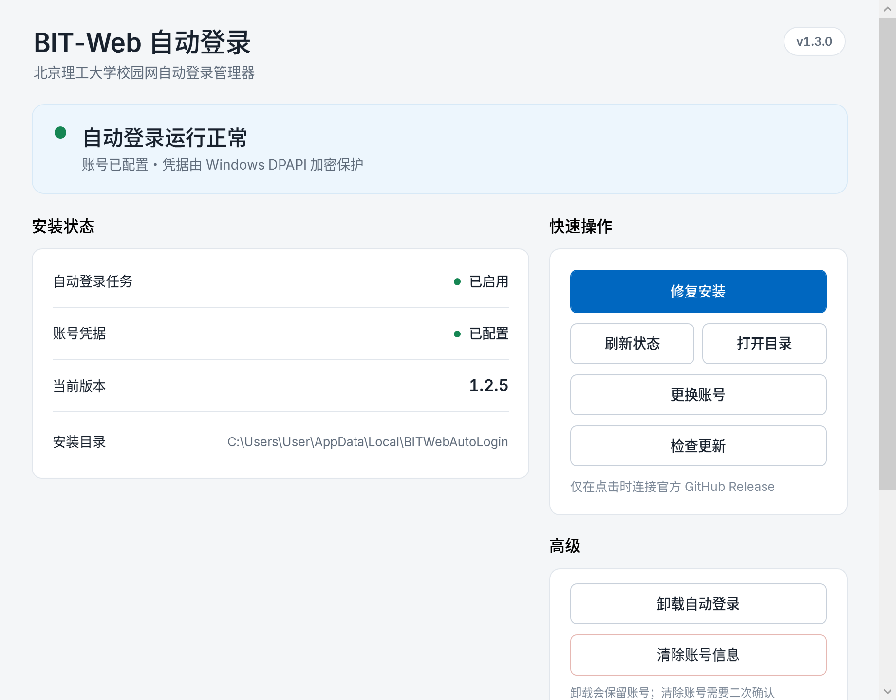

# BIT-Web Auto Login v1.3 Phase 3 Report

日期：2026-09-06
分支：`feature/native-manager`
基线提交：`76c164bba13d1b4e0d3cef0ead9b29001c256c10`

## 1. 阶段结论

Phase 3 已完成 Native Manager 的 Release-first 原生更新链路：

```text
手动检查官方 Release
→ 数值化版本比较
→ 下载 Release Asset 与 SHA-256
→ 重定向、哈希、ZIP、必要文件和 PowerShell 语法校验
→ 准备独立 Updater helper
→ Manager 退出
→ helper 备份并替换文件
→ 复用 Install.ps1 完成任务兼容部署
→ 启动新 Manager 做版本与状态桥健康检查
→ 成功后重启，失败则回滚旧文件并恢复启动
```

Native Manager 正式路径只使用 GitHub Releases，不把 `main` 作为普通用户更新渠道。旧 PowerShell 更新器继续保留，未删除、未改写。

在当前官方仓库只有 `v1.2.5` 且没有 Release Asset 的情况下，真实 GitHub 测试仅执行只读 Release API；下载、替换、失败回滚使用 Fake HTTP 与隔离临时目录完成，没有更新本机正式安装目录。

## 2. PowerShell 更新器行为基线

完整盘点见 [v1.3-phase3-update-baseline.md](./v1.3-phase3-update-baseline.md)。旧实现的主要行为是：

- 优先读取最新 Release，没有 Release 时回退到 `main` 最新提交；
- 固定官方仓库 API 与 GitHub 下载 URL；
- 下载 source archive；
- 校验归档结构、必要文件及 PowerShell Parser 语法；
- 通过现有安装器部署；
- 保存远端版本或提交信息；
- 失败时清理临时目录，但没有完整的 Manager 文件锁处理、启动健康检查和事务式回滚。

Native Manager 继承其来源锁定、结构检查、PowerShell Parser 和安装器复用思想，同时把正式策略收口为 Release-only，并补齐独立 helper 与回滚。

## 3. C# UpdateService

新增的更新服务集中在：

```text
manager/BITWebManager/Services/UpdateService.cs
manager/BITWebManager/Services/UpdateSecurity.cs
manager/BITWebManager/Services/UpdatePackageValidator.cs
manager/BITWebManager/Services/UpdateLauncher.cs
```

职责划分：

| 组件 | 职责 |
|---|---|
| `UpdateService` | Release 查询、下载、SHA-256、准备更新 |
| `UpdateSecurity` | 仓库、API、版本 tag、资产和重定向 URL 规则 |
| `UpdatePackageValidator` | ZIP 安全解压、结构/文件/版本/PowerShell 语法校验 |
| `UpdateLauncher` | 只向独立 helper 传 PID、路径和预期版本 |

网络实现只使用 .NET 8 自带的 `HttpClient` 与 `System.Text.Json`，无 Git、无 GitHub token、无第三方 SDK。

请求头包含：

```text
User-Agent: BITWebAutoLogin/1.3
Accept: application/vnd.github+json
X-GitHub-Api-Version: 2022-11-28
```

检查超时为 15 秒，下载超时为 5 分钟；检查和下载阶段接受 `CancellationToken`。

## 4. Release 资产规范

正式资产固定为：

```text
BITWebAutoLogin-v1.3.0-win-x64.zip
BITWebAutoLogin-v1.3.0-win-x64.zip.sha256
```

后续版本按相同规则替换版本号。更新器不使用 GitHub 自动生成的 `Source code.zip`，因为它不包含已构建的 WPF Manager 与 Updater。

资产必须使用单一根目录：

```text
BITWebAutoLogin-v1.3.0-win-x64/
```

包内必须同时包含登录核心、管理脚本、legacy fallback、Manager、Updater 和三个 JSON bridge/validation 脚本。包中出现任意位置的 `credential.xml` 会被拒绝。

## 5. URL 与重定向安全模型

固定仓库：

```text
Owner      = Oblivionis-ling
Repository = bit-web-auto-login
API        = https://api.github.com/repos/Oblivionis-ling/bit-web-auto-login/releases/latest
```

初始资产 URL 必须同时满足：

- HTTPS；
- 主机为 `github.com`；
- 路径属于官方仓库的指定 Release tag；
- 文件名精确匹配预期 ZIP 或 `.sha256`。

`HttpClientHandler.AllowAutoRedirect` 被关闭，每一跳手动验证，最多 5 跳。允许的最小主机集合为：

```text
github.com
objects.githubusercontent.com
release-assets.githubusercontent.com
```

Release 页面也必须位于官方仓库的 `/releases/` 路径下。用户不能输入或配置更新 URL。

## 6. 更新模型与版本策略

`UpdateInfo` 将 GitHub JSON 映射为固定字段：

```text
CurrentVersion
LatestVersion
ReleaseTag
ReleaseName
PublishedAt
DownloadUrl
ChecksumUrl
ReleasePageUrl
IsUpdateAvailable
```

tag 只接受严格的 `vMAJOR.MINOR.PATCH`。比较使用 `System.Version`，因此 `1.10.0 > 1.9.0`；相等显示“已是最新版本”，远端较低时禁止降级。

版本来源已明确分层：

| 来源 | 用途 |
|---|---|
| `manager/Directory.Build.props` | Manager 与 Updater assembly/file version |
| 本机 `settings.json` | 已安装登录核心版本 |
| Manager assembly | 当前更新客户端版本 |
| GitHub Release tag | 可用远端版本 |

界面 Header 从 Manager assembly 读取 `v1.3.0`，状态卡继续显示本机已安装核心版本，因此当前截图中的 `v1.3.0` 与 `1.2.5` 分别代表 Manager 和既有安装，不是同一字段重复。

## 7. ZIP 与内容校验

更新包校验包含：

- 最多 5000 个 ZIP entries；
- 解压后总大小最多 500 MiB；
- 拒绝绝对路径、盘符、`.`、`..`、Zip Slip 和 Unix symlink；
- 每个输出路径 canonicalize 后必须仍在 payload 内；
- 拒绝 `credential.xml`；
- 固定根目录与必要文件清单；
- `settings.json` 版本必须等于 Release 版本；
- `BITWebManager.exe` FileVersion 必须等于 Release 版本；
- 所有 `.ps1`、`.psm1` 在部署前通过 Windows PowerShell Parser。

SHA-256 文件是自动安装的必要资产。当前阶段没有自行发明哈希来源；正式 Release 必须同时发布由构建流程生成的 `.sha256`。

## 8. Updater helper 与 self-update

新增独立控制台 helper：

```text
manager/BITWebUpdater/
```

helper 不包含 GitHub、网络、凭据、计划任务业务或 UI。它只接收：

```text
Manager PID
prepared directory
target directory
expected version
result path
```

生产目标目录必须精确等于：

```text
%LOCALAPPDATA%\BITWebAutoLogin
```

prepared 目录必须是系统临时目录下形如：

```text
BITWebAutoLogin-update-<unique-id>\payload
```

测试模式则只能进入 `%TEMP%\BITWebAutoLogin-updater-tests\` 的子目录。helper 会验证 PID 确实属于目标目录中的 `BITWebManager.exe`，等待 Manager 退出后才替换文件。

## 9. 备份、健康检查与回滚

部署不是“先删旧版再复制”。每个将被替换的现有文件先进入唯一 backup 目录，新文件通过临时名写入后再替换。

部署后：

1. 复用 `Install.ps1` 完成既有任务部署；
2. 启动新 Manager 的 `--health-check` 模式；
3. 校验 Manager assembly 版本；
4. 实际调用状态 JSON bridge；
5. 成功后写 `update-result.json` 并启动新 Manager。

若 Installer 或健康检查失败：

1. 逆序恢复已有文件；
2. 删除本次新增文件；
3. 再运行旧 Installer 恢复任务指向；
4. 写失败结果；
5. 重新启动可恢复的旧 Manager。

隔离部署测试已验证健康检查失败时旧文件、旧 Manager 与凭据均保持可用。

## 10. credential 与 settings 策略

更新链路不会读取、复制、移动或覆盖 `credential.xml`：

- 包含凭据的 ZIP 在验证阶段直接拒绝；
- helper 遇到凭据文件同样拒绝；
- 正式目录中的已有 DPAPI 文件不进入 backup/deploy 列表。

`settings.json` 采用：

```text
新包默认设置
+ 旧文件中的用户字段（Version 除外）
+ 新 Release Version
```

因此已有用户设置保留，新版本新增默认字段也能进入配置。

## 11. Install.ps1 的唯一兼容修改

本阶段对 `Install.ps1` 做了一处必要的小改：移除源码内硬编码的 `1.2.5`，改为读取并严格校验 `settings.json` 中的三段式版本号。

原因：若仍硬编码 `1.2.5`，任何已经通过 C# 验证的 `v1.3.x` 合法资产在 helper 调用现有 Installer 时都会必然失败，完整更新链路无法成立。

未修改以下行为：

- 计划任务创建/更新；
- 凭据读取、写入或 DPAPI 边界；
- 网络或登录核心；
- 文件部署循环；
- 开始菜单入口；
- 启动/重试策略。

`Uninstall.ps1` 和 `BITWebAutoLogin.Management.psm1` 未修改。

## 12. UI 与取消行为

原来的禁用按钮“检查更新 · Phase 3”已改成“检查更新”，接入现有统一 Busy 状态。

阶段文案包括：

```text
正在检查更新…
发现新版本 v1.3.x
正在下载更新… / 已下载 xx MB
正在验证更新包…
正在准备安装…
正在完成更新…
```

检查与下载可取消。进入已验证的部署交接后设置 `IsCriticalOperation = true`，用户手动关窗会被阻止；只有完成 helper 启动后，Manager 才允许自身退出。所有管理写操作继续互斥。

失败时显示用户级错误，错误码、HTTP 状态、stderr 或异常进入技术详情。本阶段仍只在用户点击时联网，没有启动检查、后台定时器、托盘或自动通知。

## 13. 实际 GUI 验收

使用 Release 构建实际启动 WPF Manager，并通过应用内截图模式按 192 DPI（Windows 200%）渲染。结果：

- 窗口成功创建并退出，exit code 0；
- 中文、字体、状态卡、动态操作与检查更新按钮正常；
- Header 显示 Manager `v1.3.0`；
- 状态区显示已有安装 `1.2.5`；
- 200% DPI 下没有控件重叠，超出默认窗口高度的内容由既有垂直滚动处理；
- 更新按钮说明明确为仅点击时连接官方 GitHub Release。

### 字体调整

视觉验收后，原先的 Segoe UI / 系统中文 fallback 被认为不够协调。经用户从更纱黑体 UI SC、思源黑体 CN、霞鹜新晰黑三款真实字库渲染结果中选择，Manager 已统一改用：

```text
更纱黑体 UI SC
Regular
SemiBold
```

实现方式：

- 两个字重作为 WPF `Resource` 嵌入 Manager assembly；
- 使用 `pack://application:,,,/Resources/Fonts/#Sarasa UI SC` 私有加载；
- 不读取系统字体、不要求用户安装字体；
- 标题、状态、按钮和正文统一使用同一字体家族；
- 技术详情中的等宽日志仍保留 `Consolas`，避免破坏日志对齐；
- `SIL Open Font License 1.1` 随构建输出到 `Licenses/Sarasa-Gothic-OFL.txt`，并列入更新包必要文件校验。

字体源文件合计约 48 MB，并嵌入 `BITWebManager.dll`。这是选择完整简体中文字库和两个真实字重带来的发布体积成本；没有使用合成粗体，也没有依赖联网字体。Phase 4 评估 self-contained 体积时应将该成本单独列出，不得通过删除许可证或依赖系统字体来缩减。

200% DPI 重新截图确认字体已实际生效，中文、数字和英文混排正常，没有出现缺字、fallback 跳变、按钮裁剪或布局重叠。

截图：



当前 computer-use 会话未暴露可控制的 Windows app surface，因此无法用鼠标自动点击 WPF 控件；验收采用真实进程启动、应用内 200% DPI 截图、ViewModel 命令链测试和服务层测试完成。

测试过程中曾有一次直接启动 framework-dependent apphost 时未把项目本地 `DOTNET_ROOT` 传给子进程，Windows 因而显示“需要安装 .NET Desktop Runtime”。这是测试命令环境错误，不是用户操作或 WPF 未处理异常。使用正确项目运行环境后，真实健康检查返回：

```json
{"schemaVersion":1,"success":true,"version":"1.3.0","detail":null}
```

## 14. 测试结果

### C# build

```text
Release build: passed
Warnings: 0
Errors: 0
```

### C# Smoke Tests

```text
35 passed, 0 failed
```

新增覆盖：

- 严格 tag 与数值版本比较；
- 相等/降级不更新；
- Release JSON 与缺失资产；
- 官方 URL、恶意重定向、匿名 rate limit；
- SHA-256 成功与不匹配；
- 下载取消；
- Zip Slip、凭据文件、缺失/非法内容与 PowerShell 语法；
- Updater 参数与目录策略；
- settings 合并和 credential 保留；
- helper handoff；
- 健康检查失败回滚；
- 无更新时不启动 helper。

### 真实 GitHub 只读测试

```text
API: releases/latest
Result: passed
Latest tag: v1.2.5
Draft: false
Prerelease: false
Assets: 0
```

Native Manager `v1.3.0` 正确判定远端 `v1.2.5` 不可用于降级，也不会因旧 Release 没有 v1.3 资产而尝试安装。

### PowerShell

```text
Syntax: 12 files, 0 errors
Offline.Tests.ps1: 27 passed, 0 failed
```

### Git whitespace

```text
git diff --check: passed
```

## 15. 真实测试与模拟边界

真实执行：

- 当前本机状态 JSON bridge；
- WPF Release build 启动；
- Manager health-check 模式；
- 200% DPI 截图；
- 官方 GitHub `releases/latest` 匿名只读请求。

Fake/隔离执行：

- ZIP 与 SHA-256 下载；
- 恶意 redirect；
- 取消；
- 安全解压；
- 文件替换；
- Installer 调用计数；
- 新 Manager 健康检查成功/失败；
- rollback；
- credential/settings 保留。

未执行：

- 当前本机正式目录的真实自更新；
- GitHub 正式或 prerelease 资产下载；
- 正式 Release 创建。

## 16. 保护文件差异

```text
AutoLogin.ps1                         无差异
BITWebAutoLogin.psm1                  无差异
BITWebAutoLogin.Management.psm1       无差异
Uninstall.ps1                         无差异
Install.ps1                           仅第 11 节所述版本来源兼容修改
```

## 17. Git status

工作树保持未提交状态，主要包括：

```text
M  .gitignore
M  Install.ps1
M  tests/Offline.Tests.ps1
?? manager/
?? scripts/Get-ManagerStatus.ps1
?? scripts/Invoke-ManagerAction.ps1
?? scripts/Test-ManagerUpdatePackage.ps1
?? docs/reports/
?? assets/readme/native-manager-phase*.png
?? global.json
```

没有 commit、push、tag 或 Release。

## 18. 已知风险

1. 当前仓库尚无包含 Native Manager 的 `v1.3.x` Release Asset，因此完整链路尚未经过 GitHub 真实二进制资产验证。
2. 当前开发构建是 framework-dependent；正式普通用户包和 helper 必须在 Phase 4 以 `win-x64 self-contained` 方式发布，避免要求用户安装 .NET Desktop Runtime。测试机通过项目本地 .NET 运行成功不等于发布问题已经解决。
3. Phase 4 仍需建立确定性的 Release 打包流程，生成固定 ZIP、SHA-256，并把 Manager/Updater/legacy fallback 放到本报告定义的结构中。
4. 旧 Installer 当前仍创建指向 legacy GUI 的开始菜单快捷方式；按任务边界，本阶段没有迁移该入口。
5. rollback 已在隔离目录和 Fake runtime 验证，仍需在 Phase 6 使用 prerelease 做真实进程锁、Installer 和任务恢复演练。

## 19. Phase 4 建议

Phase 4 只处理安装与升级兼容：

1. 建立 `win-x64 self-contained` Manager/Updater 发布产物；
2. 编排固定 Release Asset 目录和 SHA-256；
3. 让 `Install.ps1` 部署 Native Manager 文件并把开始菜单入口迁移到 `BITWebManager.exe`；
4. 保留 v1.2.5 用户的 `credential.xml`、settings 与计划任务；
5. 在隔离目标完成 `v1.2.5 → v1.3.0` 升级测试；
6. Phase 6/7 再使用 `v1.3.0-rc.1` prerelease 做真实 GitHub asset 与 self-update 验证。

## 20. 最终验收问题

如果 GitHub 上存在一个符合本报告资产规范、包含 self-contained Manager/Updater 且 SHA-256 正确的下一版本 Release Asset，当前 Native Manager 已具备：

```text
安全发现 → 下载 → 验证 → 替换 → 重启 → 必要时回滚
```

完整机制。

结论：**Phase 3 机制层面为“是”**；正式发布可信度仍需 Phase 4 的产物构建和 Phase 6/7 的真实 prerelease 升级验证闭环。
