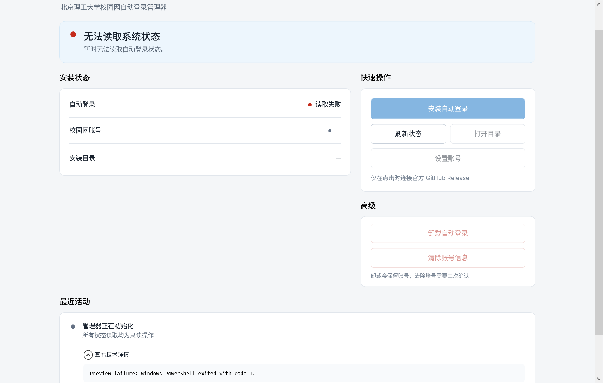

# BIT-Web Auto Login v1.3 Phase 5 Report

日期：2026-09-06
分支：`feature/native-manager`
目标版本：`1.3.0`
验收产物：`win-x64`、self-contained、compressed single-file Release ZIP

## 1. 阶段结论

Phase 5 已完成 Native Manager 的最终视觉、状态反馈、危险确认、应用图标、README 用户路径和 Phase 6 RC 材料收口。功能集合与信息架构保持冻结，没有增加设置中心、托盘、后台更新、Dark Mode、原生账号输入或其他产品能力。

本轮所有截图均由最终 Release ZIP 内的 `BITWebManager.exe` 直接启动并渲染，不使用 `dotnet run`、framework-dependent apphost 或 Visual Studio Debug 版本。

主要修改文件：

```text
manager/BITWebManager/App.xaml
manager/BITWebManager/MainWindow.xaml(.cs)
manager/BITWebManager/ConfirmationDialog.xaml(.cs)
manager/BITWebManager/ViewModels/MainWindowViewModel.cs
manager/BITWebManager/Models/LaunchOptions.cs
manager/BITWebManager/Services/PreviewStatusService.cs
manager/BITWebManager/Services/WpfUserDialogService.cs
manager/BITWebManager/BITWebManager.csproj
Install.ps1
build/Build-Release.ps1
build/New-AppIcon.ps1
build/New-Phase6RcSnapshot.ps1
README.md / CHANGELOG.md
tests/Offline.Tests.ps1 / tests/Installer.Native.Tests.ps1
assets/app-icon.svg / assets/readme/ / assets/qa/v1.3-phase5/
```

## 2. 最终 GUI

最终界面继续使用单页 Dashboard：

```text
Header
总体状态
安装状态 + 快速操作
高级操作
最近活动 / 折叠技术详情
安全说明
```

本轮没有重排信息架构，主要调整如下：

- Header 标题略微收紧，版本只保留右上角 `v1.3.0`；
- 安装状态卡移除重复版本行，不再把受保护核心脚本里的历史 `1.2.5` 暴露给普通用户；
- “自动登录任务 / 账号凭据”改为“自动登录 / 校园网账号”，减少内部术语；
- 已安装状态的唯一 Primary 操作为“检查更新”；未安装状态为“安装自动登录”；
- “修复安装”回到 Secondary 层级；
- 卸载与清除账号统一为弱红色 Danger 样式，并与普通操作保持空间分离；
- 状态卡、Header、管理区和最近活动之间的垂直间距小幅收紧；
- 安全说明改为三句直接面向用户的文案，不展示 SHA、JSON 或 bridge 等实现细节。

最终 README 主截图：


## 3. 字体

保持用户已经选定的：

```text
Sarasa UI SC Regular
Sarasa UI SC SemiBold
```

没有更换字体、删除字重或进行 font subsetting。SemiBold 只用于 Header、区块标题、主要状态和 Primary 操作；Secondary / Danger 按钮改为 Regular。技术详情继续使用 Consolas，中文 UI 与英文版本号、路径和数字的混排未发现基线漂移或裁剪。

更纱黑体带来的约 23.48 MiB 发布增量仍视为已经接受的产品成本。

## 4. 状态视觉与反馈

状态继续使用小圆点与短文案，不对整页大面积着色：

| 状态 | 颜色与语义 |
| --- | --- |
| 正常 | 小面积绿色状态点 |
| 警告 / 未安装 / 已停用 | 橙色状态点 |
| 错误 | 红色状态点与单行错误反馈 |
| 未知 | 中性灰或橙色，不表现为灾难性故障 |
| Busy | 蓝色阶段文案、indeterminate progress、冲突操作禁用 |
| Disabled | 降低透明度，仍保持文字可读 |

截图验收发现旧实现中“更新失败 / 已是最新版”只出现在页面下方 Recent Activity，用户停留在顶部时不易察觉。本轮在总体状态卡内加入同一位置的轻量反馈行：

- `正在检查更新…`
- `当前已是最新版本`
- `已下载 42.6 MB / 114.9 MB`
- `正在验证更新包…`
- `正在准备安装…`
- `检查更新失败`

Busy 结束后不会残留上一个阶段；成功、取消和失败反馈与最近活动使用一致文案。技术异常仍默认折叠。

## 5. 按钮与键盘状态

三种按钮层级已经统一：

- Primary：蓝色实心，同一状态仅一个；
- Secondary：白底、统一边框、40 DIP 高度、Regular 字重；
- Danger：白底、弱红边框和文字，不使用大面积红色。

每种按钮都具有显式的 hover、pressed、disabled 和 keyboard focus 状态。Danger 不再继承蓝色 hover；确认窗默认焦点停在“取消”，按 Enter 不会直接执行危险操作。主窗口 XAML 的 Tab 顺序按主要操作、辅助操作、高级操作和错误详情自然排列，Enter / Space 使用 WPF 原生命令行为。

## 6. DPI、尺寸与布局验收

目标 DPI 截图全部来自最终 self-contained EXE：

| DPI | 场景 | 结果 |
| --- | --- | --- |
| 100% / 96 DPI | 当前物理系统、正常已安装、最小 760×620 | 通过；字体清晰，主状态与主要操作完整可见 |
| 125% / 120 DPI | Fresh install | 通过；中文基线和按钮垂直居中正常 |
| 150% / 144 DPI | 正常、读取失败、更新失败、危险 Dialog | 通过；无重叠或横向滚动 |
| 175% / 168 DPI | 检查、下载、验证和准备更新 | 通过；Busy 文案和禁用态连续 |
| 200% / 192 DPI | 正常、长路径、关闭操作 Dialog | 通过；安装路径省略与 ToolTip 逻辑保留 |

额外检查：

- 最小窗口 `760×620`：核心状态和 Primary 操作仍可见，低优先级内容纵向滚动；
- 默认窗口 `920×720`：常见状态不需要横向滚动；
- 宽窗口 `1280×900`：Dashboard 限制在 1000 DIP 内容宽度内居中，不被无意义拉伸；
- 长安装路径：单行 ellipsis，不挤压左侧标签；
- 长错误详情：Consolas 文本框限制高度并独立滚动；
- 最大化等更宽布局沿用相同 `MaxWidth` 约束。

当前系统通过 `GetDpiForSystem` 读取为 96 DPI（100%）。当前 Codex 会话的 computer-use 只开放浏览器表面，没有原生应用或 Windows 设置控制，因此无法自动把物理显示器依次切换到 125%～200%。这些档位使用最终 EXE 的 WPF DPI 捕获模式完成字体与布局渲染检查；真实 OS 缩放切换保留为 Phase 6 RC 的人工项目。

截图集位于 `assets/qa/v1.3-phase5/`，包括：

```text
normal-installed-100.png
fresh-install-125.png
error-state-150.png
error-details-expanded-150.png
update-current-150.png
update-available-150.png
update-checking-175.png
update-downloading-175.png
update-validating-175.png
update-preparing-175.png
update-failure-150.png
normal-installed-200.png
long-path-200.png
minimum-window-100.png
wide-window-150.png
danger-uninstall-150.png
danger-clear-credential-150.png
close-busy-200.png
```

## 7. Fresh install、已安装与错误状态

Fresh install 状态明确显示：

```text
自动登录尚未安装
自动登录尚未设置，校园网账号也未配置。
Primary：安装自动登录
```

已安装正常状态明确显示“自动登录运行正常”“校园网账号已配置”，Primary 为“检查更新”。普通界面只显示 `BIT-Web v1.3.0`，不会同时显示 `Core 1.2.5`。

状态读取失败不会崩溃；总体卡显示用户级错误，详细异常在“查看技术详情”内使用 Consolas 展示。更新失败会在顶部立即出现单行红色反馈，不要求用户先滚动到底部。

错误详情验收：



## 8. 更新体验

通过隐藏的 Preview QA 参数从同一个 Release EXE 验收了：

```text
正在检查更新
当前已是最新版
发现新版本
正在下载
正在验证
正在准备安装
更新失败
```

Preview 参数不出现在普通 UI，不改变 UpdateService、官方仓库锁定、SHA-256、Updater、回滚或取消逻辑。进入 critical deployment 后的关闭阻止策略保持不变。

真实 GitHub 只读探测本轮返回匿名 API `403 rate limit`。离线测试已覆盖并通过这一错误映射；Phase 3 以前的真实官方 Release 读取已有成功记录。本轮没有为了测试创建 Release、token 或绕过限流。

## 9. 确认 Dialog

原生 MessageBox 已收口为轻量 WPF 模态确认窗，以便与主界面的更纱黑体、按钮样式、图标和 DPI 行为一致。

- 卸载：明确只停止并移除计划任务，Manager、脚本、日志、设置和账号继续保留；
- 清除账号：明确停用任务并删除当前用户 DPAPI 凭据，其他文件不删除；
- 第二次清除确认继续保留；
- 可取消操作中关闭：明确“取消并退出”的含义；
- critical operation 中关闭仍提示等待，不允许中断部署。

所有危险确认默认聚焦“取消”，Dialog 支持 Tab、Enter、Space 和 Escape。


## 10. 凭据窗口协作

Phase 5 没有原生化账号输入。生产路径继续通过 Windows PowerShell 交互进程调用现有 `Get-Credential`：

- 密码不进入命令行参数；
- C# 不读取 `credential.xml`；
- C# 不调用 `.Password`、`GetNetworkCredential`、`Import-Clixml` 或 `Export-Clixml`；
- 取消会映射为用户级“账号输入已取消”，并恢复 Manager Busy 状态；
- 交互 PowerShell 使用正常窗口模式，非交互桥接继续隐藏控制台。

computer-use 安全规则禁止自动化认证 Dialog，因此本轮没有自动点击、填写或截图真实凭据窗口，也没有读取或改变当前凭据。其前景焦点与任务栏协作需要在 Phase 6 真机 RC 中由用户安全地完成一次取消流程确认。

## 11. 应用图标

新增项目自有图标，不使用北理官方 Logo。设计为墨蓝圆角 Utility tile、白色连接形态 `B` 和青色状态节点。

ICO 包含独立帧：

```text
16 / 20 / 24 / 32 / 48 / 64 / 128 / 256 px
```

已应用到：

- `BITWebManager.exe` PE 资源；
- WPF 主窗口标题栏；
- WPF 确认 Dialog；
- 任务栏；
- 开始菜单快捷方式 `IconLocation=BITWebManager.exe,0`。

从最终 EXE 提取的实际小尺寸图标：


源文件与生成工具：

```text
assets/app-icon.svg
build/New-AppIcon.ps1
manager/BITWebManager/Resources/BITWebManager.ico
```

## 12. README 与 CHANGELOG

README 已按普通用户路径收口：

```text
BIT-Web 是什么
→ 下载 Release ZIP
→ 双击 Install.cmd
→ 从开始菜单打开 Manager
→ 使用与安全更新
→ 安全边界
→ FAQ
→ 技术结构
```

README 主区域只引用最终 `native-manager-v1.3.png`，不再混用 Phase 1～4 或 WinForms 截图。旧截图仍保留在开发报告中。

CHANGELOG 的 v1.3.0 条目保持面向最终用户，只增加独立 Manager、Release 更新器、高 DPI、安全回滚、凭据保留、统一入口、字体和图标等结果，不记录 Phase 1～5 的流水过程。

## 13. Accessibility

完成最低可访问性检查：

- Primary、Secondary、Danger 均有可见键盘焦点；
- 确认 Dialog 默认焦点为取消；
- 危险操作可用 Escape 关闭；
- WPF Button 原生支持 Enter / Space；
- 信息不只依赖颜色，状态点始终配有文字；
- 浅色背景、正文和辅助文本的对比未发现不可读组合；
- 横向滚动禁用，窄窗口使用纵向滚动；
- 技术详情为只读文本，可使用键盘选择和滚动。

## 14. Authenticode / SmartScreen 评估

当前最终 Manager 与 Updater 均为：

```text
Authenticode status: NotSigned
```

个人开发者可选方案：

1. 购买公开 CA 的标准代码签名证书；通常为每年约 100～500 美元，实际价格、硬件密钥或云签名费用依 CA 与地区变化；
2. EV 代码签名通常更贵，常见为每年数百美元以上，并有更严格的身份与私钥保护要求；
3. 若资格和地区支持，可评估 Microsoft Trusted Signing 等托管签名方案。

代码签名能确认发布者与文件完整性，并有助于积累 SmartScreen 信誉，但不能保证全新证书立即完全消除提示。当前缺少 Authenticode 不阻塞 v1.3.0 RC；README 已诚实说明 SmartScreen 可能出现，并要求只从官方 Release 下载和核对 SHA-256。

## 15. 安全复查

- `AutoLogin.ps1`：零差异；
- `BITWebAutoLogin.psm1`：零差异；
- `Uninstall.ps1`：零差异；
- C# 静态搜索未发现凭据读取、密码属性访问或 DPAPI 解密实现；
- 不新增遥测、日志上传、后台检查、托盘或 GUI 开机启动；
- 真实卸载、清除凭据、修复、换号和更新部署均未在主环境执行。

## 16. 测试结果

最终基线：

```text
.NET Release build             0 warnings, 0 errors
C# Smoke + Release validator   36 passed, 0 failed
PowerShell Offline             29 passed, 0 failed
Native Installer isolated       3 passed, 0 failed
PowerShell syntax              16 files, 0 errors
Release ZIP validator          passed
ZIP SHA-256                    matched
Manager health check           passed
Updater self-contained start   passed (reached argument validation)
ICO frames                     8 validated
git diff --check               passed (only expected LF→CRLF notices)
```

最终本地 Release：

```text
ZIP:       114.96 MiB
Unpacked:  129.72 MiB
Files:     23
SHA-256:   ff167e937af7de4f1e512471f618514e03448185f1382a61e3b90d53a6be47bd
```

Manager 健康检查在移除 `DOTNET_ROOT`、PATH 不含 `dotnet`、但保留项目要求的 Windows PowerShell 5.1 后返回：

```json
{"schemaVersion":1,"success":true,"version":"1.3.0","detail":null}
```

## 17. Phase 6 RC 准备

已准备但未执行：

- `build/New-Phase6RcSnapshot.ps1`；
- `docs/reports/v1.3-phase6-rc-checklist.md`。

快照工具只允许写入 `artifacts/phase6-rc-snapshot/`，记录 credential SHA-256 而不复制凭据内容，并保存 settings 备份、任务 XML、任务元数据、Shortcut 信息和安装目录文件 manifest。脚本要求显式传入 `-AcknowledgeLocalMetadata`，避免误生成包含本机路径和用户名的 QA 材料。

## 18. 已知风险与未完成项

1. 125%～200% 已通过最终 EXE 的 WPF DPI 渲染截图，但尚未在当前物理显示器上逐档切换 Windows 缩放；Phase 6 应人工复核。
2. 真实 `Get-Credential` 窗口不能由自动化工具操作；需要 Phase 6 人工确认它位于 Manager 前景，并测试取消恢复。
3. 当前未签名，SmartScreen 可能提示未知发布者；README 已披露，不阻塞 RC。
4. 本轮真实 GitHub API 遇到匿名限流；应用的 403 文案和离线错误映射已通过测试。
5. 受保护 `AutoLogin.ps1` 内部仍含历史 `1.2.5` 日志字符串；普通 GUI 已不显示该实现细节。

## 19. Git 状态

当前分支：

```text
feature/native-manager
```

工作树保持未提交状态。主要修改 / 新增范围为：

```text
M  CHANGELOG.md / Install.ps1 / README.md / settings.json / tests/Offline.Tests.ps1
?? manager/ / build/ / docs/reports/ / assets/qa/ / Native Manager screenshots
?? scripts/Get-ManagerStatus.ps1 / Invoke-ManagerAction.ps1 / Test-ManagerUpdatePackage.ps1
?? tests/Installer.Native.Tests.ps1 / global.json
```

`git diff --check` 通过；输出仅包含仓库现有 Windows 工作区的 LF→CRLF 提示，不包含 whitespace error。

## 20. 阶段状态

Phase 5 已暂停，未进入 Phase 6，未 commit、push、tag 或创建 GitHub Release。
